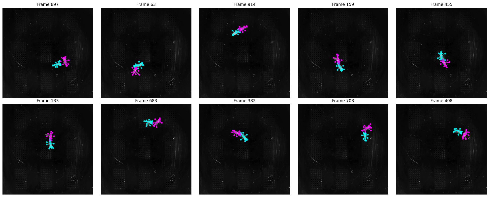
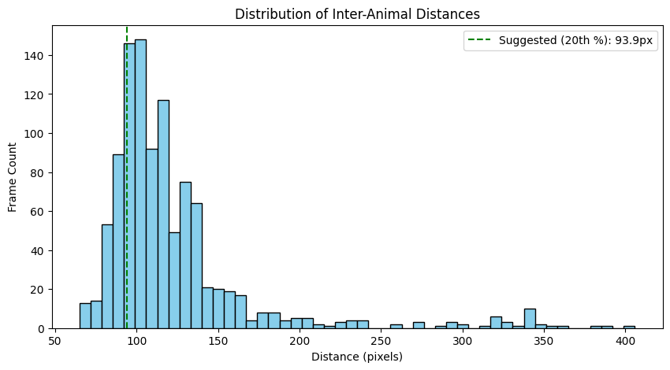
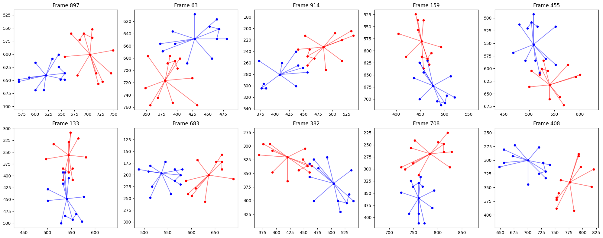
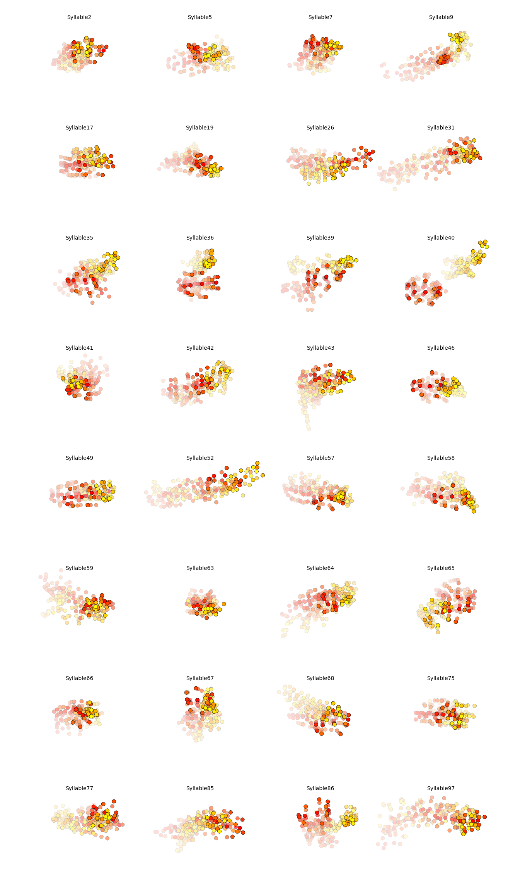
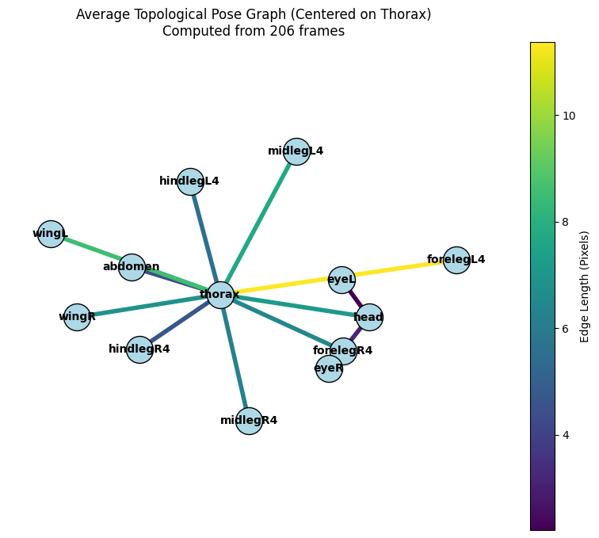

# Graph-Theoretic Analysis of Multi-Animal Social Behavior

[](https://python.org)
[](https://sleap.ai)
[](https://github.com/dattalab/keypoint-moseq)

A computational framework for analyzing social behavior in multi-animal experiments using **graph theory**, **spectral entropy**, and **unsupervised behavioral syllable discovery**.



## Overview

This project extends traditional pose estimation pipelines (SLEAP) with graph-theoretic metrics to capture the **topological complexity** of social interactions. Rather than reducing behavior to simple distance thresholds, we formalize animal poses and inter-animal relationships as dynamic graphs and apply spectral analysis to extract latent behavioral features.

### Key Contributions

1. **Pose Graph Formalization**: Convert SLEAP tracking data into temporal graph structures where nodes represent anatomical landmarks and edges encode skeletal connectivity.

2. **Social Graph Construction**: Build dynamic inter-animal graphs where edges represent proximity/interaction events between individuals.

3. **Von Neumann Entropy Profiling**: Apply spectral entropy to quantify behavioral complexity—detecting phase transitions between low-complexity states (locomotion) and high-complexity states (social investigation, mating).

4. **Keypoint-MoSeq Integration**: Discover unsupervised "behavioral syllables" using AR-HMM modeling, then correlate these syllables with graph entropy metrics.

## Results

### Distance Distribution Analysis


### Social vs. Pose Entropy


### Behavioral Syllable Discovery


### High-Entropy Social Frames


## Methods

### Graph Topologies

| Graph Type | Nodes | Edges | Purpose |
|------------|-------|-------|---------|
| **Pose Graph** | Body parts | Skeletal connections | Quantify individual posture complexity |
| **Social Graph** | All landmarks (both animals) | Proximity-based connections | Capture interaction topology |
| **Dyad Graph** | Combined skeleton | Within + between-animal edges | Joint pose-interaction analysis |

### Spectral Metrics

- **Von Neumann Entropy**: $S_{VN} = -\sum_i \eta_i \ln(\eta_i)$ where $\eta_i$ are normalized Laplacian eigenvalues
- **Fiedler Value**: Algebraic connectivity (2nd smallest eigenvalue)
- **Degree Distribution**: Node connectivity patterns

### Keypoint-MoSeq Pipeline

1. Format SLEAP tracks as "Dyad" skeleton (26 nodes = 13 per animal)
2. Fit PCA for dimensionality reduction
3. Train AR-HMM to discover behavioral syllables
4. Correlate syllable identity with social entropy

## Installation

```bash
# Clone repository
git clone https://github.com/rmharp/DATA890.git
cd DATA890

# Create virtual environment
python -m venv .venv
source .venv/bin/activate  # or .venv\Scripts\activate on Windows

# Install dependencies
pip install numpy scipy networkx matplotlib seaborn pandas h5py torch
pip install sleap-io keypoint-moseq jax jaxlib
```

> **Note**: Keypoint-MoSeq requires JAX. On Apple Silicon, use `pip install jax-metal` for GPU acceleration.

## Data

### Drosophila Courtship Dataset
- **Source**: SLEAP example dataset
- **Species**: *Drosophila melanogaster*
- **Setup**: Male-female courtship assay (2D top-down)
- **Landmarks**: 13 per fly (head, thorax, abdomen, wings, legs)

### Directory Structure

```
DATA890/
├── Final_Project.ipynb          # Main analysis notebook
├── drosophila-melanogaster-courtship/
│   ├── courtship_labels.slp     # SLEAP annotations
│   ├── predictions/             # Model predictions
│   └── skeleton.json            # Skeleton definition
├── moseq_project/
│   ├── config.yml               # Keypoint-MoSeq config
│   ├── test_model/              # Trained AR-HMM model
│   └── syllables.png            # Syllable visualization
├── media/                       # Result figures
└── frames1/                     # Extracted video frames
```

## Usage

Open `Final_Project.ipynb` and run cells sequentially:

1. **Load Data**: Parse SLEAP `.analysis.h5` files
2. **Build Graphs**: Construct pose and social graphs per frame
3. **Compute Entropy**: Calculate Von Neumann entropy traces
4. **Run MoSeq**: Discover behavioral syllables
5. **Correlate**: Link syllables to entropy peaks

### Example: Compute Social Entropy

```python
import numpy as np
import networkx as nx

def build_social_graph(frame_coords, threshold=50.0):
    """Build proximity-based social graph."""
    G = nx.Graph()
    valid_pts = [(i, pt) for i, pt in enumerate(frame_coords) if not np.isnan(pt).any()]
    
    for i, pt in valid_pts:
        G.add_node(i, pos=pt)
    
    for i, (idx_i, pt_i) in enumerate(valid_pts):
        for idx_j, pt_j in valid_pts[i+1:]:
            dist = np.linalg.norm(pt_i - pt_j)
            if dist < threshold:
                G.add_edge(idx_i, idx_j, weight=1.0 / (dist + 1e-6))
    
    return G

def von_neumann_entropy(G):
    """Compute spectral entropy of graph Laplacian."""
    if G.number_of_nodes() < 2:
        return 0.0
    
    L = nx.laplacian_matrix(G).toarray().astype(float)
    eigenvalues = np.linalg.eigvalsh(L)
    eigenvalues = eigenvalues[eigenvalues > 1e-10]  # Remove zero eigenvalues
    
    if len(eigenvalues) == 0:
        return 0.0
    
    # Normalize
    eigenvalues = eigenvalues / eigenvalues.sum()
    entropy = -np.sum(eigenvalues * np.log(eigenvalues + 1e-10))
    
    return entropy
```

## Key Findings

1. **Syllable 41** is the dominant behavior during high-intensity social interaction (high entropy)
2. **Social entropy spikes** correspond to moments when animals form dense proximity networks
3. **Graph-theoretic metrics** capture interaction complexity invisible to simple distance thresholds

## References

- Pereira, T.D., et al. (2022). *SLEAP: A deep learning system for multi-animal pose tracking*. Nature Methods.
- Weinreb, C., et al. (2024). *Keypoint-MoSeq: parsing behavior by linking point tracking to pose dynamics*. Nature Methods.
- Sizemore, A.E., et al. (2018). *The importance of the whole: Topological data analysis for the network neuroscientist*. Network Neuroscience.

## License

MIT License - see [LICENSE](LICENSE) for details.

## Author

Riley Harper  
Duke University  
DATA 890: Advanced Topics in Data Science

